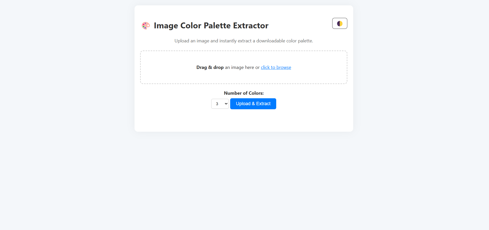
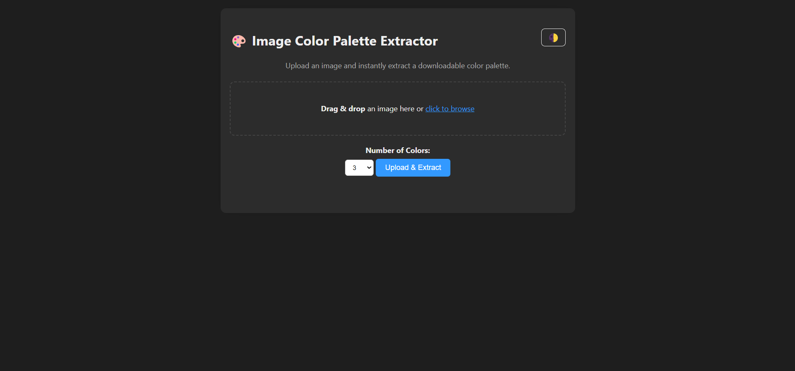

# 🎨 Image Color Palette Extractor


An elegant web app that allows users to upload an image and instantly extract a beautiful, downloadable color palette. Built with Flask, Pillow, scikit-learn, and responsive HTML/CSS.

---

## 🖼️ Preview

### Light Mode



### Dark Mode



---

## ✨ Features

- Drag & drop image upload
- Live preview of the uploaded image
- User-selectable number of dominant colors (3–10)
- Download color palette as `.zip` (PNG + JSON)
- Responsive design for mobile and desktop
- Dark mode toggle 🌙


## 📦 Installation

### Clone the repo
```bash
git clone https://github.com/AchrafBoudabous/color_palette_extractor.git
cd color_palette_extractor
```

### Create & activate virtual environment
```bash
python -m venv venv
source venv/bin/activate  # On Windows: venv\Scripts\activate
```

### Install dependencies
```bash
pip install -r requirements.txt
```

### Run the app
```bash
flask run
```

Then open [http://127.0.0.1:5000](http://127.0.0.1:5000) in your browser.

---

## 🧪 Built With

- [Python](https://www.python.org/)
- [Flask](https://flask.palletsprojects.com/)
- [Pillow](https://python-pillow.org/)
- [scikit-learn](https://scikit-learn.org/)
- [Matplotlib](https://matplotlib.org/)
- HTML5 + CSS3 (Responsive, mobile-first)
- Vanilla JavaScript

---

## 📁 Project Structure

```
color_palette_extractor/
├── app.py
├── palette.py
├── templates/
│   └── index.html
├── static/
│   ├── style.css
│   └── uploads/
│   └── screenshots/
│       ├── light-mode.png
│       └── dark-mode.png
├── requirements.txt
├── README.md
```
---

## ⭐️ Star This Repo

If you like this project, consider giving it a ⭐️ on GitHub!